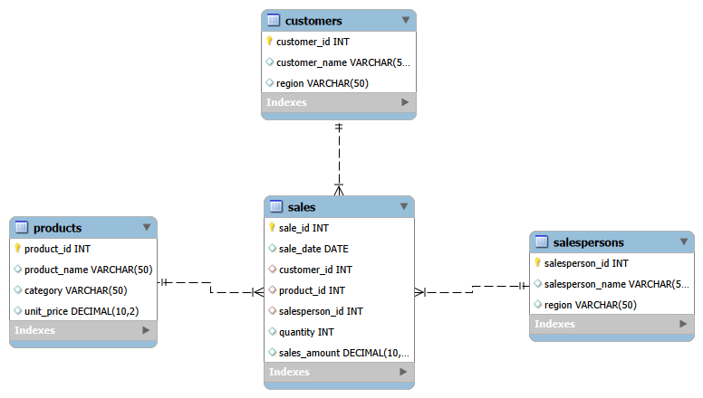

# 📊 Sales Performance Analysis using MySQL

## 📌 Project Overview

This project demonstrates how SQL can be used to analyze business sales data and generate meaningful business insights. A relational database was designed and populated with sample sales data, followed by analytical SQL queries to evaluate sales performance, customer behavior, product performance, and salesperson contributions.

---

## 🎯 Objectives

* Analyze overall sales performance
* Identify top-performing products
* Evaluate salesperson performance
* Analyze customer purchasing behavior
* Compare sales across different regions
* Perform monthly revenue analysis
* Apply advanced SQL concepts to solve business problems

---

## 🗄️ Database Schema

The database consists of four related tables:

* Customers
* Products
* Salespersons
* Sales

The **Sales** table acts as the fact table and references the remaining tables using foreign keys.

### Entity Relationship Diagram (ERD)



---

## 🛠️ Technologies Used

* MySQL
* SQL
* Jupyter Notebook
* MySQL Workbench

---

## 📚 SQL Concepts Demonstrated

* DDL (CREATE TABLE)
* DML (INSERT)
* Aggregate Functions
* GROUP BY
* HAVING
* INNER JOIN
* CASE Statements
* Subqueries
* Common Table Expressions (CTEs)
* Window Functions
* ROW_NUMBER()
* RANK()
* DENSE_RANK()
* NTILE()
* LAG()
* Running Total
* Date Functions

---

## 📈 Business Insights

* Identified the highest revenue-generating products.
* Evaluated customer purchasing behavior.
* Ranked top-performing salespersons.
* Compared sales performance across regions.
* Analyzed monthly revenue trends.
* Calculated running revenue totals.
* Compared current revenue with previous month revenue using window functions.

---

## 📂 Repository Structure

```
Sales-Performance-Analysis-SQL
│
├── sql_project.ipynb
├── sales_data.sql
├── ER_diagram.png
└── README.md
```

---

## 🚀 How to Run

1. Install MySQL.
2. Create a database named **company**.
3. Execute the SQL script (`sales_data.sql`) to create and populate the tables.
4. Open `sql_project.ipynb` in Jupyter Notebook.
5. Update the MySQL connection string with your local credentials.
6. Run the notebook cells to reproduce the analysis.

---

## 👤 Author

**Mohamed Faisal**

Aspiring Data Analyst | SQL | Python | Excel | Power BI
